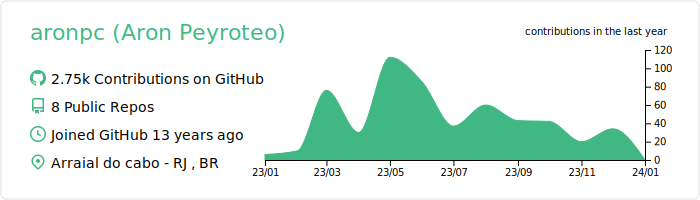
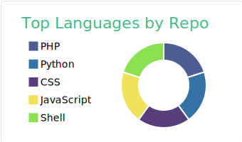
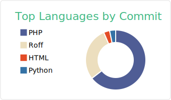
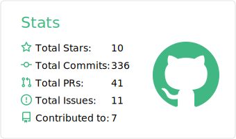
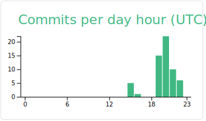

## vue

[](https://github.com/vn7n24fzkq/github-profile-summary-cards)
[](https://github.com/vn7n24fzkq/github-profile-summary-cards) [](https://github.com/vn7n24fzkq/github-profile-summary-cards)
[](https://github.com/vn7n24fzkq/github-profile-summary-cards) [](https://github.com/vn7n24fzkq/github-profile-summary-cards)
### Now you can add this to your markdown
```

<<<<<<< HEAD
[](https://github.com/vn7n24fzkq/github-profile-summary-cards)
[](https://github.com/vn7n24fzkq/github-profile-summary-cards) [](https://github.com/vn7n24fzkq/github-profile-summary-cards)
[](https://github.com/vn7n24fzkq/github-profile-summary-cards) [](https://github.com/vn7n24fzkq/github-profile-summary-cards)
=======
[](https://github.com/vn7n24fzkq/github-profile-summary-cards)
[](https://github.com/vn7n24fzkq/github-profile-summary-cards) [](https://github.com/vn7n24fzkq/github-profile-summary-cards)
[](https://github.com/vn7n24fzkq/github-profile-summary-cards) [](https://github.com/vn7n24fzkq/github-profile-summary-cards)
>>>>>>> 5124892... profile base

```

### Each card usage
---


```
<<<<<<< HEAD

=======

>>>>>>> 5124892... profile base
```

    

---


```
<<<<<<< HEAD

=======

>>>>>>> 5124892... profile base
```

    

---


```
<<<<<<< HEAD

=======

>>>>>>> 5124892... profile base
```

    

---


```
<<<<<<< HEAD

=======

>>>>>>> 5124892... profile base
```

    

---


```
<<<<<<< HEAD

=======

>>>>>>> 5124892... profile base
```

    
